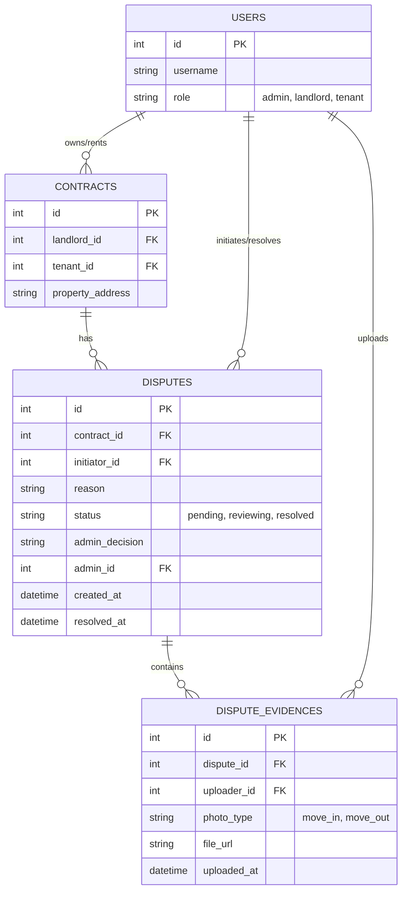

# 資料庫設計 (爭議仲裁功能)

## 1. ER 圖（實體關係圖）

## 2. 資料表詳細說明

### USERS
系統使用者表，包含房東、房客與管理員。
- `id`: INTEGER, Primary Key
- `username`: TEXT, 必填, 使用者名稱
- `role`: TEXT, 必填, 角色 (admin, landlord, tenant)

### CONTRACTS
租賃合約表，紀錄房東與房客的租賃關係。
- `id`: INTEGER, Primary Key
- `landlord_id`: INTEGER, 必填, Foreign Key (USERS.id)
- `tenant_id`: INTEGER, 必填, Foreign Key (USERS.id)
- `property_address`: TEXT, 必填, 租屋地址

### DISPUTES
爭議案件表，記錄每次的仲裁請求。
- `id`: INTEGER, Primary Key
- `contract_id`: INTEGER, 必填, Foreign Key (CONTRACTS.id)
- `initiator_id`: INTEGER, 必填, Foreign Key (USERS.id)
- `reason`: TEXT, 必填, 爭議原因與說明
- `status`: TEXT, 必填, 狀態 (pending, reviewing, resolved)
- `admin_decision`: TEXT, 管理員的裁決結果說明
- `admin_id`: INTEGER, Foreign Key (USERS.id)
- `created_at`: DATETIME, 必填, 發起時間
- `resolved_at`: DATETIME, 裁決時間

### DISPUTE_EVIDENCES
爭議證據表，記錄雙方上傳的照片。
- `id`: INTEGER, Primary Key
- `dispute_id`: INTEGER, 必填, Foreign Key (DISPUTES.id)
- `uploader_id`: INTEGER, 必填, Foreign Key (USERS.id)
- `photo_type`: TEXT, 必填, 照片類型 (move_in, move_out)
- `file_url`: TEXT, 必填, 圖片存放路徑
- `uploaded_at`: DATETIME, 必填, 上傳時間
