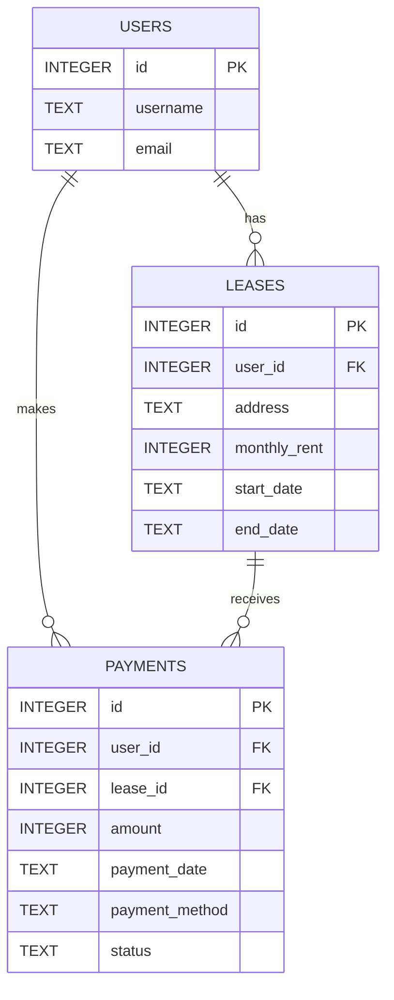

# 資料庫設計 (DB DESIGN)

## 1. ER 圖（實體關係圖）

## 2. 資料表詳細說明

### `users` (使用者 / 租客)
儲存租客的基本資訊。
- `id` (INTEGER): Primary Key, 自動遞增。
- `username` (TEXT): 租客姓名，必填。
- `email` (TEXT): 聯絡信箱，必填且唯一。

### `leases` (租約)
儲存租約資訊與每月應繳金額。
- `id` (INTEGER): Primary Key, 自動遞增。
- `user_id` (INTEGER): Foreign Key，關聯至 `users.id`，代表承租人。
- `address` (TEXT): 租屋處地址，必填。
- `monthly_rent` (INTEGER): 每月應繳租金，必填。
- `start_date` (TEXT): 租約起始日 (ISO 格式 YYYY-MM-DD)。
- `end_date` (TEXT): 租約結束日 (ISO 格式 YYYY-MM-DD)。

### `payments` (繳費紀錄)
紀錄每一筆線上繳費交易，防詐騙平台的核心紀錄。
- `id` (INTEGER): Primary Key, 自動遞增。
- `user_id` (INTEGER): Foreign Key，關聯至 `users.id`。
- `lease_id` (INTEGER): Foreign Key，關聯至 `leases.id`。
- `amount` (INTEGER): 實際繳款金額。
- `payment_date` (TEXT): 繳費完成時間 (ISO 格式 YYYY-MM-DD HH:MM:SS)。
- `payment_method` (TEXT): 繳費方式，如 "Credit Card"。
- `status` (TEXT): 交易狀態，如 "Completed", "Failed"。
