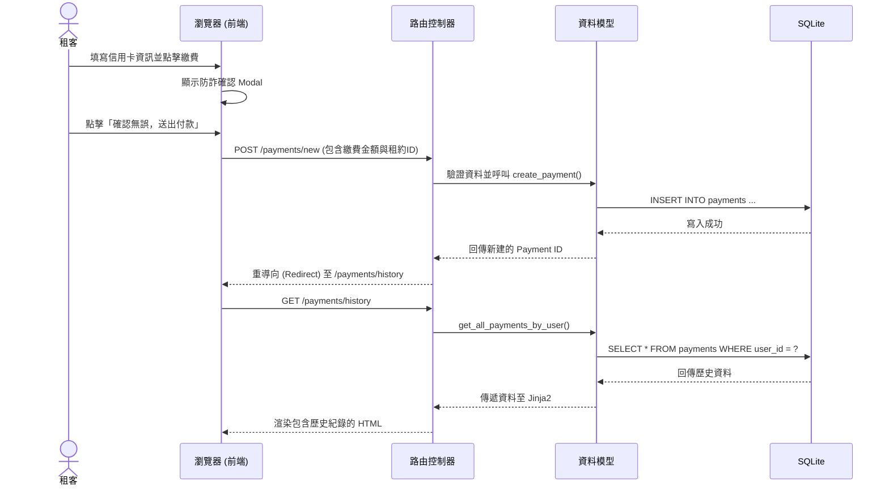

# 流程圖設計 (FLOWCHART)

本文件描述「線上繳交房租」功能的使用者操作路徑與系統背後的資料流動方式。

## 1. 使用者流程圖（User Flow）

此流程圖展示租客進入平台後，如何完成繳費並查看紀錄。

```mermaid
flowchart LR
    Start([登入系統 / 首頁]) --> Dashboard[查看當期應繳房租]
    Dashboard --> Action{選擇操作}
    
    Action -->|點擊繳款| PaymentForm[填寫線上繳費表單\n(模擬信用卡)]
    PaymentForm --> ConfirmModal[跳出防詐騙安全確認]
    ConfirmModal -->|確認收款方正確| SubmitPayment[送出付款]
    ConfirmModal -->|發現異常| CancelPayment[取消並回報]
    SubmitPayment --> Success[付款成功提示]
    Success --> HistoryList
    
    Action -->|查看紀錄| HistoryList[歷史繳費紀錄列表]
```

## 2. 系統序列圖（Sequence Diagram）

此序列圖描述當使用者在「線上繳費表單」按下確認後，系統內部的互動過程。



## 3. 功能清單與路由對照表

| 功能名稱 | 說明 | URL 路徑 | HTTP 方法 |
| --- | --- | --- | --- |
| **首頁 / 儀表板** | 顯示當期應繳資訊，並提供繳款入口 | `/` | GET |
| **進入繳費頁面** | 顯示線上付款表單 | `/payments/new` | GET |
| **送出繳費** | 接收表單資料，寫入資料庫 | `/payments/new` | POST |
| **繳費紀錄列表** | 列出該使用者過去所有的繳費紀錄 | `/payments/history` | GET |
