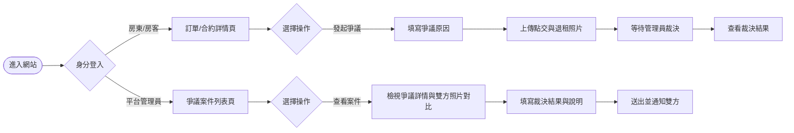
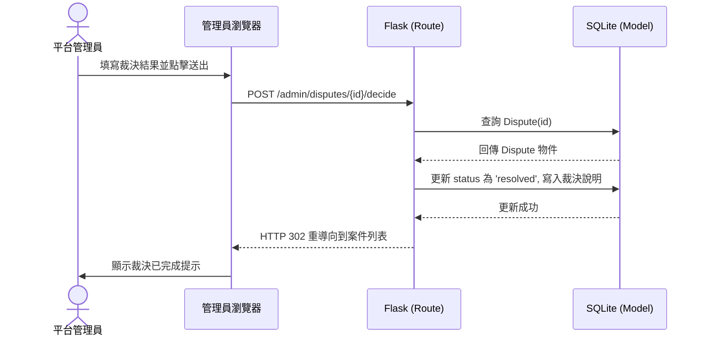

# 流程圖設計 (爭議仲裁功能)

## 1. 使用者流程圖（User Flow）

## 2. 系統序列圖（Sequence Diagram）
以「管理員送出裁決結果」為例的完整流程：

## 3. 功能清單對照表

| 功能名稱 | 對應 URL 路徑 | HTTP 方法 | 說明 |
| --- | --- | --- | --- |
| 建立爭議 | `/disputes/create` | GET / POST | 房東/房客填寫表單發起爭議 |
| 上傳照片 | `/disputes/<id>/upload` | GET / POST | 雙方上傳入住與退租照片 |
| 查看案件詳情(用戶) | `/disputes/<id>` | GET | 雙方查看爭議狀態與結果 |
| 爭議案件列表(管理員) | `/admin/disputes` | GET | 管理員查看所有待處理案件 |
| 查看案件與對比照片(管理員) | `/admin/disputes/<id>` | GET | 管理員檢視雙方證據照片 |
| 送出裁決結果(管理員) | `/admin/disputes/<id>/decide` | POST | 管理員送出裁決與說明 |
